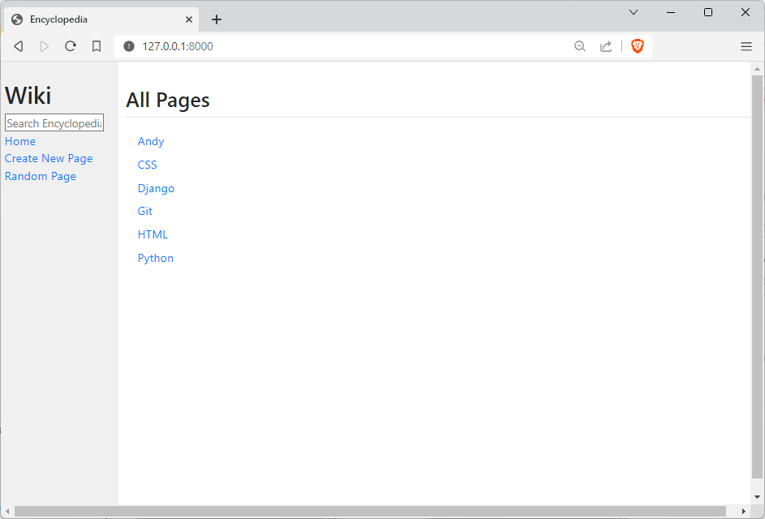
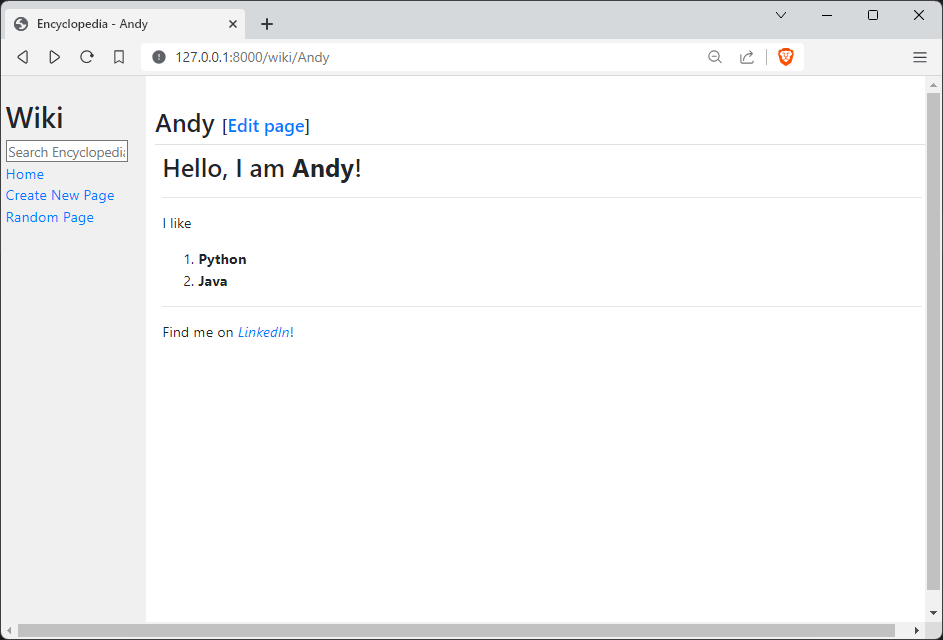
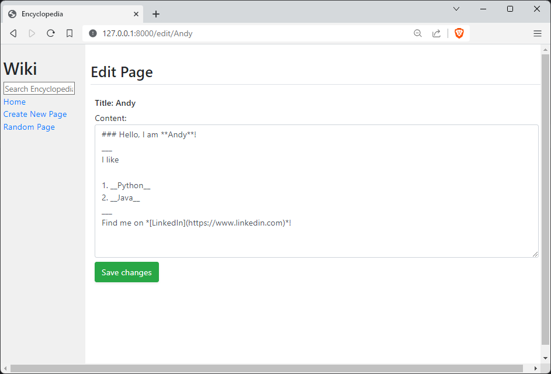
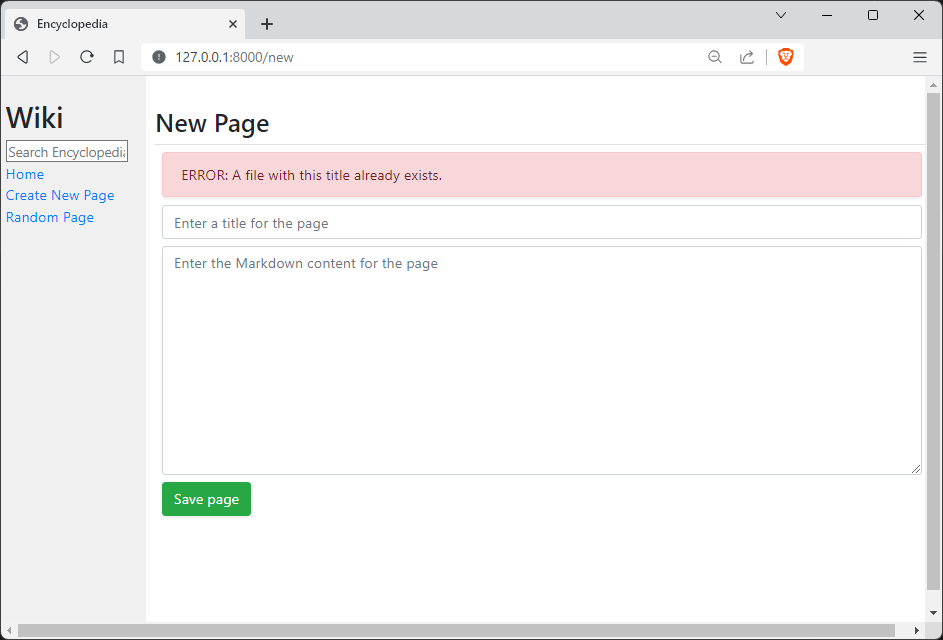
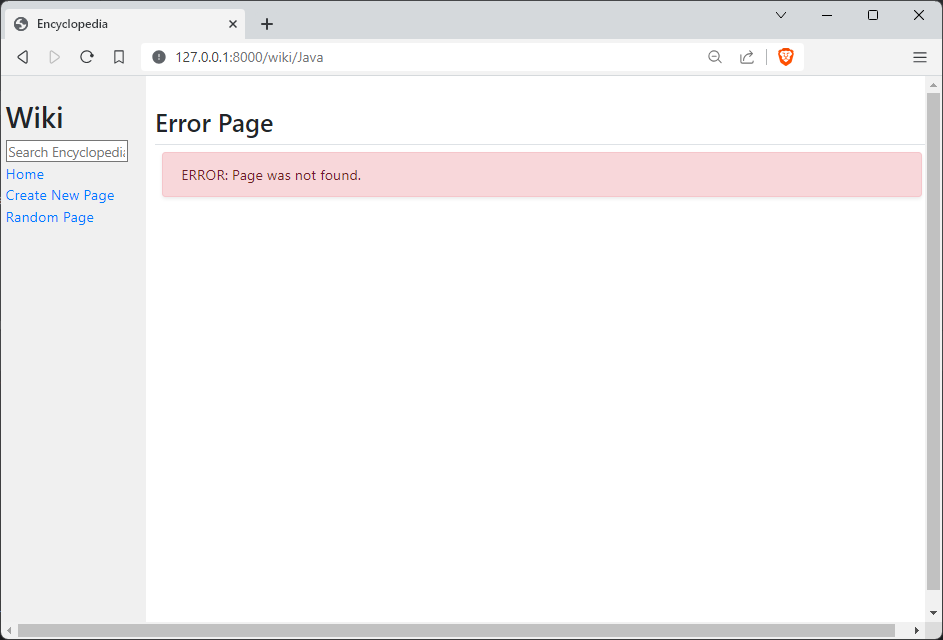

# Encyclopedia
#### 📘 Project 1 from Edx | Harvard CS50's Web Programming with Python and JavaScript Course
✒️ Design a Wikipedia-like online encyclopedia.

## Specification 
🚀 https://cs50.harvard.edu/web/2020/projects/1/wiki/

## Video
🚀 https://youtu.be/sVDdQjUeHkg

### Requirements

* Python 3.11.1
* Django 4.1.4
* markdown2 2.4.10
* django-markdownify 0.9.0

__TIP__: If you have a _requirements.txt_ file type this command: __python -m pip install -r requirements.txt__

### How to run? 
1. Go to the directory which contains "__manage.py__" file
2. Then type this command: __python manage.py runserver__
3. In your Web browser use a URL: __http://127.0.0.1:8000/__
